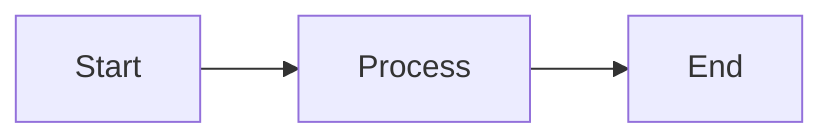

# Blog Post Template

Use this template when creating new blog posts. It incorporates best practices from all four expert agents.

---

## Front Matter Template

```yaml
---
title: "Your Catchy Title Here"  # Tech Blogger: Make it engaging!
date: YYYY-MM-DD HH:MM:SS -0500  # Jekyll Expert: Use correct timezone
categories: [Category1, Category2]  # Max 2 categories
tags: [tag1, tag2, tag3, tag4, tag5]  # 3-5 relevant tags
description: "SEO-optimized description (150-160 chars). Include main keywords."  # Technical Editor: Clear & complete
image:
  path: /assets/img/posts/your-image.png  # Optional hero image
  alt: "Descriptive alt text"  # Technical Editor: Accessibility matters
author: ebmarquez
pin: false  # Set to true for featured posts
math: false  # Set to true if using KaTeX math equations
mermaid: false  # Set to true if using Mermaid diagrams
---
```

---

## Structure Template

### 1. Hook (Tech Blogger Territory)

```markdown
## [Engaging Opening Title]

[2-3 sentences that grab attention. Use a relatable scenario, surprising fact, 
or pop culture reference. Make them want to keep reading!]

Example:
"Remember when [relatable problem]? We've all been there. What if I told you 
there's a better way that doesn't involve [humorous consequence]?"
```

### 2. Context & Why This Matters

```markdown
## Why Should You Care?

[2-3 paragraphs explaining:
- The problem this solves
- Who this is for
- What they'll learn/achieve]

> **Note:** [Any important context or prerequisites]
{: .prompt-info }
```

### 3. Main Content

```markdown
## The Main Content

### Subsection 1

[Clear explanation of concept]

#### Example or Code Block

```language
// Code example with comments
const example = 'Clear, working code';
// Explain what this does
```
{: file='filename.ext'}

> **Tip:** [Helpful insight or best practice]
{: .prompt-tip }

### Subsection 2

[Continue building knowledge]

⚠️ **Common Pitfall**: [What to avoid]

```language
// ❌ Don't do this
badExample();

// ✅ Do this instead
goodExample();
```

### Subsection 3

[More content, examples, or deep dives]
```

### 4. Practical Application

```markdown
## Real-World Example

[Walk through a complete, practical example that readers can follow]

1. **Step 1**: [Clear instruction]
   ```bash
   command --with-options
   ```

2. **Step 2**: [Clear instruction]
   ```language
   code_example();
   ```

3. **Step 3**: [Clear instruction]
```

### 5. Troubleshooting (If Applicable)

```markdown
## Common Issues & Solutions

### Issue 1: [Problem description]

**Symptom:** [What the user sees]

**Solution:**
```language
// Fix code
```

**Why it works:** [Explanation]

### Issue 2: [Problem description]

[Follow same pattern]
```

### 6. Conclusion & Next Steps

```markdown
## Wrapping Up

[2-3 sentences summarizing:
- What we covered
- Key takeaway
- Memorable closing thought]

## What's Next?

- [Action item or next learning step]
- [Related topic to explore]
- [Link to related post or resource]

## Further Reading

- [Official documentation](https://example.com)
- [Related blog post](#)
- [Community resource](https://example.com)
```

---

## Chirpy Theme Features Reference

### Prompts/Callouts

```markdown
> Example info prompt
{: .prompt-info }

> Example tip
{: .prompt-tip }

> Example warning
{: .prompt-warning }

> Example danger/error
{: .prompt-danger }
```

### Code Blocks with File Names

```markdown
```yaml
code: here
```
{: file='path/to/file.yml'}
```

### Images

```markdown
{: width="700" height="400" }
_Image caption_

{: .light }
{: .dark }
```

### Mermaid Diagrams

```markdown
Set `mermaid: true` in front matter, then:


```

### Tables

```markdown
| Header 1 | Header 2 | Header 3 |
| -------- | -------- | -------- |
| Value 1  | Value 2  | Value 3  |
```

### Links

```markdown
[External Link](https://example.com)
[Internal Post]()
[Tab Page](/about/)
```

---

## Pre-Publishing Checklist

### Tech Blogger Review
- [ ] Opening hook is engaging
- [ ] Complex concepts have relatable analogies
- [ ] Tone is consistent (witty but professional)
- [ ] Scannable structure (headings, lists, code blocks)
- [ ] Conclusion has memorable takeaway

### Technical Editor Review
- [ ] Technical accuracy verified
- [ ] Terminology consistent throughout
- [ ] Code examples tested and working
- [ ] Links valid and relevant
- [ ] Front matter complete and correct
- [ ] SEO description optimized (150-160 chars)
- [ ] Tags relevant and appropriately numbered (3-5)
- [ ] Proper grammar and spelling
- [ ] Headings follow logical hierarchy

### Jekyll Expert Review
- [ ] Front matter follows Chirpy schema
- [ ] File named correctly: `YYYY-MM-DD-title.md`
- [ ] Located in `_posts/` directory
- [ ] Uses Chirpy theme features correctly
- [ ] Code blocks have language specified
- [ ] Image paths correct (if used)
- [ ] Liquid syntax correct (if used)
- [ ] Builds without errors locally

### DevOps Expert Review
- [ ] Will build successfully in CI/CD
- [ ] No hardcoded secrets or sensitive data
- [ ] Images optimized (size/format)
- [ ] No broken external links
- [ ] Workflow examples use current action versions
- [ ] Compatible with upstream theme structure

---

## Quick Start: Create New Post

```bash
# From repository root
cd _posts

# Create new post file (Jekyll Expert approved naming)
touch $(date +%Y-%m-%d)-your-post-title.md

# Copy template
cat << 'EOF' > $(date +%Y-%m-%d)-your-post-title.md
---
title: "Your Title"
date: $(date +"%Y-%m-%d %H:%M:%S %z")
categories: [Category1, Category2]
tags: [tag1, tag2, tag3]
description: "Your description"
author: ebmarquez
pin: false
math: false
mermaid: false
---

## Your Engaging Hook

[Start writing!]
EOF

# Test locally (DevOps Expert recommends)
bundle exec jekyll serve
```

---

## Tips from Your Experts

**Tech Blogger says:** *"Don't be afraid to have fun! Technical accuracy and entertainment aren't mutually exclusive."*

**Technical Editor says:** *"Every sentence should earn its place. If it doesn't add value, cut it."*

**Jekyll Expert says:** *"Use Chirpy's built-in features—they're there for a reason and they work great!"*

**DevOps Expert says:** *"Test locally first. Future you will thank present you."*

---

*Save this template and refer to it for every blog post. Your agents are here to help!*
